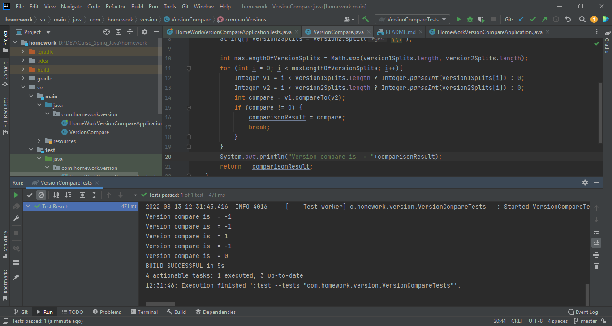
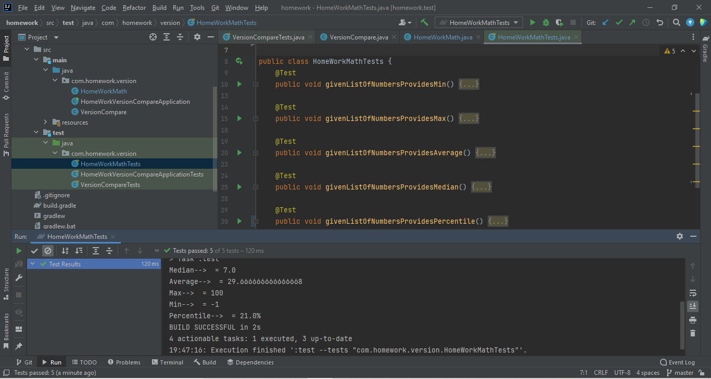

# HomeWork Version Compare

Util - 'compare versions'
Implement a utility ( in Java). Spring with Gradle.
Compare two version numbers version1 and version2.
If version1 > version2 return 1
If version1 < version2 return -1
otherwise return 0

# HomeWork Math API
Implement a web service (in Java). Spring with Gradle.
/min - given list of numbers and a quantifier (how many) provides min number(s)
/max - given list of numbers and a quantifier (how many) provides max number(s)
/avg - given list of numbers calculates their average
/median - given list of numbers calculates their median
/percentile - given list of numbers and quantifier 'q', compute the qth percentile of the list elements

